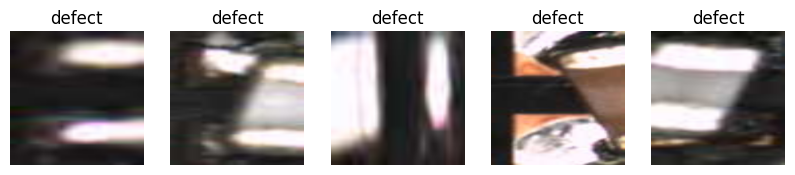
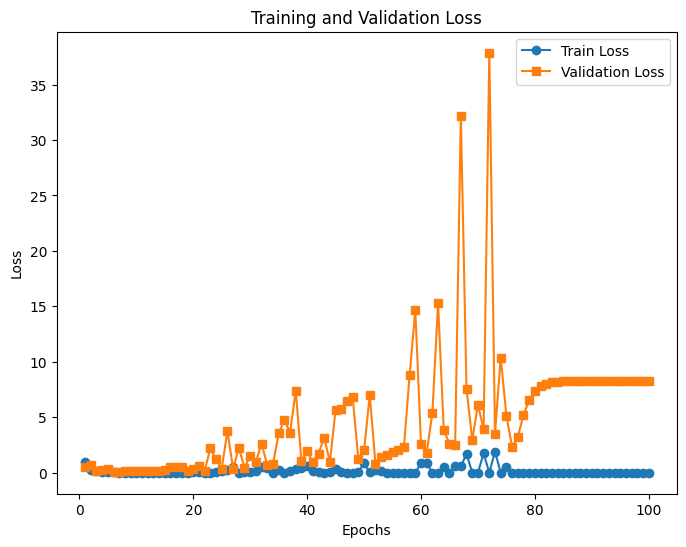
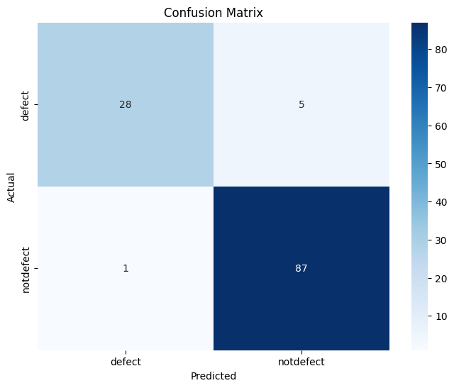
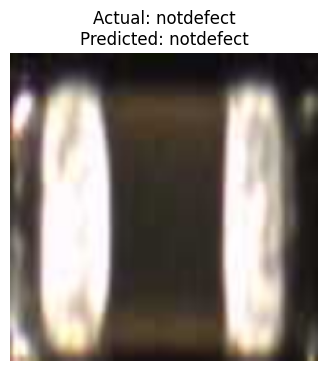

# DL- Developing a Neural Network Classification Model using Transfer Learning

## AIM
To develop an image classification model using transfer learning with VGG19 architecture for the given dataset.

## Problem Statement 

The problem statement for this experiment is to develop an image classification model that can accurately distinguish between 'defect' and 'notdefect' semiconductor chip images. This is a binary classification task, where the goal is to leverage transfer learning using a pre-trained VGG19 model to effectively classify new, unseen chip images.


## Neural Network Model


## DESIGN STEPS
### STEP 1: 
Import required libraries and define image transforms.

### STEP 2: 
Load training and testing datasets using ImageFolder.
### STEP 3: 
Visualize sample images from the dataset.
### STEP 4: 
Load pre-trained VGG19, modify the final layer for binary classification, and freeze feature extractor layers.
### STEP 5: 
Define loss function (BCEWithLogitsLoss) and optimizer (Adam). Train the model and plot the loss curve.
### STEP 6: 
Evaluate the model with test accuracy, confusion matrix, classification report, and visualize predictions.


## PROGRAM

### Name:SUDHARSAN S

### Register Number:212224040334

```python
import torch
import torch.nn as nn
import torch.optim as optim
import torchvision
import torchvision.transforms as transforms
from torch.utils.data import DataLoader
from torchvision import models, datasets
from torchvision.models import VGG19_Weights
import matplotlib.pyplot as plt
import numpy as np
from sklearn.metrics import confusion_matrix, classification_report
import seaborn as sns
```


```python
from google.colab import drive
drive.mount('/content/drive')
```

    Mounted at /content/drive
    


```python
## Step 1: Load and Preprocess Data
# Define transformations for images
transform = transforms.Compose([
    transforms.Resize((224, 224)),  # Resize images for pre-trained model input
    transforms.ToTensor(),
    #transforms.Normalize([0.485, 0.456, 0.406], [0.229, 0.224, 0.225])  # Standard normalization for pre-trained models
])
```


```python
!unzip -qq /content/drive/MyDrive/chip_data.zip -d data
```


```python
# Load dataset from a folder (structured as: dataset/class_name/images)
dataset_path = "./data/dataset/"
train_dataset = datasets.ImageFolder(root=f"{dataset_path}/train", transform=transform)
test_dataset = datasets.ImageFolder(root=f"{dataset_path}/test", transform=transform)
```


```python
# Display some input images
def show_sample_images(dataset, num_images=5):
    fig, axes = plt.subplots(1, num_images, figsize=(10, 10))
    for i in range(num_images):
        image, label = dataset[i]
        image = image.permute(1, 2, 0)  # Convert tensor format (C, H, W) to (H, W, C)
        axes[i].imshow(image)
        axes[i].set_title(dataset.classes[label])
        axes[i].axis("off")
    plt.show()
```


```python
# Show sample images from the training dataset
show_sample_images(train_dataset)
```


    

    


```python
# Get the total number of samples in the training dataset
print(f"Total number of training samples: {len(train_dataset)}")

# Get the shape of the first image in the dataset
first_image, label = train_dataset[0]
print(f"Shape of the first image: {first_image.shape}")
```

    Total number of training samples: 172
    Shape of the first image: torch.Size([3, 224, 224])
    


```python
# Get the total number of samples in the testing dataset
print(f"Total number of testing samples: {len(test_dataset)}")

# Get the shape of the first image in the dataset
first_image1, label = test_dataset[0]
print(f"Shape of the first image: {first_image1.shape}")

```

    Total number of testing samples: 121
    Shape of the first image: torch.Size([3, 224, 224])
    


```python
# Create DataLoader for batch processing
train_loader = DataLoader(train_dataset, batch_size=32, shuffle=True)
test_loader = DataLoader(test_dataset, batch_size=32, shuffle=False)

```


```python
## Step 2: Load Pretrained Model and Modify for Transfer Learning
# Load a pre-trained VGG19 model
# write your code here
model=models.vgg19(weights=VGG19_Weights.DEFAULT)


```
```
    Downloading: "https://download.pytorch.org/models/vgg19-dcbb9e9d.pth" to /root/.cache/torch/hub/checkpoints/vgg19-dcbb9e9d.pth
    

    100%|██████████| 548M/548M [00:05<00:00, 107MB/s] 
    
```

```python
# Move model to GPU if available
device = torch.device("cuda" if torch.cuda.is_available() else "cpu")
model = model.to(device)
```


```python
from torchsummary import summary
# Print model summary
summary(model, input_size=(3, 224, 224))
```
```
    ----------------------------------------------------------------
            Layer (type)               Output Shape         Param #
    ================================================================
                Conv2d-1         [-1, 64, 224, 224]           1,792
                  ReLU-2         [-1, 64, 224, 224]               0
                Conv2d-3         [-1, 64, 224, 224]          36,928
                  ReLU-4         [-1, 64, 224, 224]               0
             MaxPool2d-5         [-1, 64, 112, 112]               0
                Conv2d-6        [-1, 128, 112, 112]          73,856
                  ReLU-7        [-1, 128, 112, 112]               0
                Conv2d-8        [-1, 128, 112, 112]         147,584
                  ReLU-9        [-1, 128, 112, 112]               0
            MaxPool2d-10          [-1, 128, 56, 56]               0
               Conv2d-11          [-1, 256, 56, 56]         295,168
                 ReLU-12          [-1, 256, 56, 56]               0
               Conv2d-13          [-1, 256, 56, 56]         590,080
                 ReLU-14          [-1, 256, 56, 56]               0
               Conv2d-15          [-1, 256, 56, 56]         590,080
                 ReLU-16          [-1, 256, 56, 56]               0
               Conv2d-17          [-1, 256, 56, 56]         590,080
                 ReLU-18          [-1, 256, 56, 56]               0
            MaxPool2d-19          [-1, 256, 28, 28]               0
               Conv2d-20          [-1, 512, 28, 28]       1,180,160
                 ReLU-21          [-1, 512, 28, 28]               0
               Conv2d-22          [-1, 512, 28, 28]       2,359,808
                 ReLU-23          [-1, 512, 28, 28]               0
               Conv2d-24          [-1, 512, 28, 28]       2,359,808
                 ReLU-25          [-1, 512, 28, 28]               0
               Conv2d-26          [-1, 512, 28, 28]       2,359,808
                 ReLU-27          [-1, 512, 28, 28]               0
            MaxPool2d-28          [-1, 512, 14, 14]               0
               Conv2d-29          [-1, 512, 14, 14]       2,359,808
                 ReLU-30          [-1, 512, 14, 14]               0
               Conv2d-31          [-1, 512, 14, 14]       2,359,808
                 ReLU-32          [-1, 512, 14, 14]               0
               Conv2d-33          [-1, 512, 14, 14]       2,359,808
                 ReLU-34          [-1, 512, 14, 14]               0
               Conv2d-35          [-1, 512, 14, 14]       2,359,808
                 ReLU-36          [-1, 512, 14, 14]               0
            MaxPool2d-37            [-1, 512, 7, 7]               0
    AdaptiveAvgPool2d-38            [-1, 512, 7, 7]               0
               Linear-39                 [-1, 4096]     102,764,544
                 ReLU-40                 [-1, 4096]               0
              Dropout-41                 [-1, 4096]               0
               Linear-42                 [-1, 4096]      16,781,312
                 ReLU-43                 [-1, 4096]               0
              Dropout-44                 [-1, 4096]               0
               Linear-45                 [-1, 1000]       4,097,000
    ================================================================
    Total params: 143,667,240
    Trainable params: 143,667,240
    Non-trainable params: 0
    ----------------------------------------------------------------
    Input size (MB): 0.57
    Forward/backward pass size (MB): 238.69
    Params size (MB): 548.05
    Estimated Total Size (MB): 787.31
    ----------------------------------------------------------------
    
```

```python
# Modify the final fully connected layer to match the dataset classes
# Write your code here
model.classifier[-1] = nn.Linear(model.classifier[-1].in_features,1)


```


```python
# Move model to GPU if available
device = torch.device("cuda" if torch.cuda.is_available() else "cpu")
model = model.to(device)
```


```python
summary(model, input_size=(3, 224, 224))
```
```
    ----------------------------------------------------------------
            Layer (type)               Output Shape         Param #
    ================================================================
                Conv2d-1         [-1, 64, 224, 224]           1,792
                  ReLU-2         [-1, 64, 224, 224]               0
                Conv2d-3         [-1, 64, 224, 224]          36,928
                  ReLU-4         [-1, 64, 224, 224]               0
             MaxPool2d-5         [-1, 64, 112, 112]               0
                Conv2d-6        [-1, 128, 112, 112]          73,856
                  ReLU-7        [-1, 128, 112, 112]               0
                Conv2d-8        [-1, 128, 112, 112]         147,584
                  ReLU-9        [-1, 128, 112, 112]               0
            MaxPool2d-10          [-1, 128, 56, 56]               0
               Conv2d-11          [-1, 256, 56, 56]         295,168
                 ReLU-12          [-1, 256, 56, 56]               0
               Conv2d-13          [-1, 256, 56, 56]         590,080
                 ReLU-14          [-1, 256, 56, 56]               0
               Conv2d-15          [-1, 256, 56, 56]         590,080
                 ReLU-16          [-1, 256, 56, 56]               0
               Conv2d-17          [-1, 256, 56, 56]         590,080
                 ReLU-18          [-1, 256, 56, 56]               0
            MaxPool2d-19          [-1, 256, 28, 28]               0
               Conv2d-20          [-1, 512, 28, 28]       1,180,160
                 ReLU-21          [-1, 512, 28, 28]               0
               Conv2d-22          [-1, 512, 28, 28]       2,359,808
                 ReLU-23          [-1, 512, 28, 28]               0
               Conv2d-24          [-1, 512, 28, 28]       2,359,808
                 ReLU-25          [-1, 512, 28, 28]               0
               Conv2d-26          [-1, 512, 28, 28]       2,359,808
                 ReLU-27          [-1, 512, 28, 28]               0
            MaxPool2d-28          [-1, 512, 14, 14]               0
               Conv2d-29          [-1, 512, 14, 14]       2,359,808
                 ReLU-30          [-1, 512, 14, 14]               0
               Conv2d-31          [-1, 512, 14, 14]       2,359,808
                 ReLU-32          [-1, 512, 14, 14]               0
               Conv2d-33          [-1, 512, 14, 14]       2,359,808
                 ReLU-34          [-1, 512, 14, 14]               0
               Conv2d-35          [-1, 512, 14, 14]       2,359,808
                 ReLU-36          [-1, 512, 14, 14]               0
            MaxPool2d-37            [-1, 512, 7, 7]               0
    AdaptiveAvgPool2d-38            [-1, 512, 7, 7]               0
               Linear-39                 [-1, 4096]     102,764,544
                 ReLU-40                 [-1, 4096]               0
              Dropout-41                 [-1, 4096]               0
               Linear-42                 [-1, 4096]      16,781,312
                 ReLU-43                 [-1, 4096]               0
              Dropout-44                 [-1, 4096]               0
               Linear-45                    [-1, 1]           4,097
    ================================================================
    Total params: 139,574,337
    Trainable params: 139,574,337
    Non-trainable params: 0
    ----------------------------------------------------------------
    Input size (MB): 0.57
    Forward/backward pass size (MB): 238.68
    Params size (MB): 532.43
    Estimated Total Size (MB): 771.69
    ----------------------------------------------------------------
    
```

```python
# Freeze all layers except the final layer
for param in model.features.parameters():
    param.requires_grad = False  # Freeze feature extractor layers
```


```python
import torch.nn as nn
import torch.optim as optim
# Include the Loss function and optimizer
criterion = nn.BCEWithLogitsLoss()
optimizer = optim.Adam(model.parameters(), lr=0.001)
```


```python
## Step 3: Train the Model
def train_model(model, train_loader,test_loader,num_epochs=100):
    train_losses = []
    val_losses = []
    model.train()
    for epoch in range(num_epochs):
        running_loss = 0.0
        for images, labels in train_loader:
            images, labels = images.to(device), labels.to(device)
            optimizer.zero_grad()
            outputs = model(images)
            loss = criterion(outputs, labels.unsqueeze(1).float())
            loss.backward()
            optimizer.step()
            running_loss += loss.item()
        train_losses.append(running_loss / len(train_loader))
        model.eval()
        val_loss = 0.0 # Initialize val_loss for each epoch
        with torch.no_grad():
            for images, labels in test_loader:
                images, labels = images.to(device), labels.to(device)
                outputs = model(images)
                loss = criterion(outputs, labels.unsqueeze(1).float())
                val_loss += loss.item()
        val_losses.append(val_loss / len(test_loader))
        model.train()
        print(f'Epoch [{epoch+1}/{num_epochs}], Train Loss: {train_losses[-1]:.4f}, Validation Loss: {val_losses[-1]:.4f}')

    # Plot training and validation loss
    print("Name:        Sudharsan S")
    print("Register Number:        212224040334")
    plt.figure(figsize=(8, 6))
    plt.plot(range(1, num_epochs + 1), train_losses, label='Train Loss', marker='o')
    plt.plot(range(1, num_epochs + 1), val_losses, label='Validation Loss', marker='s')
    plt.xlabel('Epochs')
    plt.ylabel('Loss')
    plt.title('Training and Validation Loss')
    plt.legend()
    plt.show()
```


```python
# Move model to GPU if available
device = torch.device("cuda" if torch.cuda.is_available() else "cpu")
model = model.to(device)
```


```python
# Train the model
# Write your code here

train_model(model, train_loader,test_loader)


```
```
    Epoch [1/100], Train Loss: 0.9811, Validation Loss: 0.5526
    Epoch [2/100], Train Loss: 0.2581, Validation Loss: 0.7066
    Epoch [3/100], Train Loss: 0.1149, Validation Loss: 0.1469
    Epoch [4/100], Train Loss: 0.0315, Validation Loss: 0.2104
    Epoch [5/100], Train Loss: 0.0803, Validation Loss: 0.3143
    Epoch [6/100], Train Loss: 0.0233, Validation Loss: 0.0742
    Epoch [7/100], Train Loss: 0.0018, Validation Loss: 0.0889
    Epoch [8/100], Train Loss: 0.0000, Validation Loss: 0.1115
    Epoch [9/100], Train Loss: 0.0000, Validation Loss: 0.1781
    Epoch [10/100], Train Loss: 0.0001, Validation Loss: 0.1979
    Epoch [11/100], Train Loss: 0.0000, Validation Loss: 0.1761
    Epoch [12/100], Train Loss: 0.0000, Validation Loss: 0.1946
    Epoch [13/100], Train Loss: 0.0004, Validation Loss: 0.1266
    Epoch [14/100], Train Loss: 0.0000, Validation Loss: 0.1245
    Epoch [15/100], Train Loss: 0.0016, Validation Loss: 0.2335
    Epoch [16/100], Train Loss: 0.0001, Validation Loss: 0.5223
    Epoch [17/100], Train Loss: 0.0000, Validation Loss: 0.5052
    Epoch [18/100], Train Loss: 0.0000, Validation Loss: 0.4848
    Epoch [19/100], Train Loss: 0.0006, Validation Loss: 0.1876
    Epoch [20/100], Train Loss: 0.0261, Validation Loss: 0.3764
    Epoch [21/100], Train Loss: 0.0356, Validation Loss: 0.6060
    Epoch [22/100], Train Loss: 0.0001, Validation Loss: 0.1634
    Epoch [23/100], Train Loss: 0.0065, Validation Loss: 2.2033
    Epoch [24/100], Train Loss: 0.0852, Validation Loss: 1.2147
    Epoch [25/100], Train Loss: 0.1254, Validation Loss: 0.3605
    Epoch [26/100], Train Loss: 0.2703, Validation Loss: 3.7716
    Epoch [27/100], Train Loss: 0.5130, Validation Loss: 0.3556
    Epoch [28/100], Train Loss: 0.0138, Validation Loss: 2.2468
    Epoch [29/100], Train Loss: 0.0848, Validation Loss: 0.4589
    Epoch [30/100], Train Loss: 0.0732, Validation Loss: 1.4734
    Epoch [31/100], Train Loss: 0.1352, Validation Loss: 0.9910
    Epoch [32/100], Train Loss: 0.5307, Validation Loss: 2.6232
    Epoch [33/100], Train Loss: 0.4472, Validation Loss: 0.6842
    Epoch [34/100], Train Loss: 0.0000, Validation Loss: 0.7690
    Epoch [35/100], Train Loss: 0.2447, Validation Loss: 3.5383
    Epoch [36/100], Train Loss: 0.0029, Validation Loss: 4.7525
    Epoch [37/100], Train Loss: 0.1483, Validation Loss: 3.6115
    Epoch [38/100], Train Loss: 0.3700, Validation Loss: 7.4036
    Epoch [39/100], Train Loss: 0.4131, Validation Loss: 1.0574
    Epoch [40/100], Train Loss: 0.5628, Validation Loss: 1.9485
    Epoch [41/100], Train Loss: 0.1773, Validation Loss: 0.9467
    Epoch [42/100], Train Loss: 0.0655, Validation Loss: 1.7321
    Epoch [43/100], Train Loss: 0.0000, Validation Loss: 3.1485
    Epoch [44/100], Train Loss: 0.0526, Validation Loss: 0.9825
    Epoch [45/100], Train Loss: 0.3727, Validation Loss: 5.6655
    Epoch [46/100], Train Loss: 0.0510, Validation Loss: 5.7758
    Epoch [47/100], Train Loss: 0.0000, Validation Loss: 6.4586
    Epoch [48/100], Train Loss: 0.0000, Validation Loss: 6.7831
    Epoch [49/100], Train Loss: 0.0748, Validation Loss: 1.2144
    Epoch [50/100], Train Loss: 0.8362, Validation Loss: 2.0056
    Epoch [51/100], Train Loss: 0.0273, Validation Loss: 7.0269
    Epoch [52/100], Train Loss: 0.2154, Validation Loss: 0.8092
    Epoch [53/100], Train Loss: 0.1320, Validation Loss: 1.4354
    Epoch [54/100], Train Loss: 0.0000, Validation Loss: 1.6112
    Epoch [55/100], Train Loss: 0.0000, Validation Loss: 1.8705
    Epoch [56/100], Train Loss: 0.0000, Validation Loss: 2.0266
    Epoch [57/100], Train Loss: 0.0133, Validation Loss: 2.2924
    Epoch [58/100], Train Loss: 0.0000, Validation Loss: 8.7900
    Epoch [59/100], Train Loss: 0.0000, Validation Loss: 14.6626
    Epoch [60/100], Train Loss: 0.8498, Validation Loss: 2.6330
    Epoch [61/100], Train Loss: 0.8661, Validation Loss: 1.8227
    Epoch [62/100], Train Loss: 0.0000, Validation Loss: 5.3898
    Epoch [63/100], Train Loss: 0.0000, Validation Loss: 15.2999
    Epoch [64/100], Train Loss: 0.5023, Validation Loss: 3.8228
    Epoch [65/100], Train Loss: 0.0000, Validation Loss: 2.6296
    Epoch [66/100], Train Loss: 0.5938, Validation Loss: 2.5446
    Epoch [67/100], Train Loss: 0.5938, Validation Loss: 32.1470
    Epoch [68/100], Train Loss: 1.6910, Validation Loss: 7.5485
    Epoch [69/100], Train Loss: 0.0000, Validation Loss: 2.9556
    Epoch [70/100], Train Loss: 0.0000, Validation Loss: 6.1006
    Epoch [71/100], Train Loss: 1.7545, Validation Loss: 3.9395
    Epoch [72/100], Train Loss: 0.0000, Validation Loss: 37.8690
    Epoch [73/100], Train Loss: 1.9126, Validation Loss: 3.5356
    Epoch [74/100], Train Loss: 0.0000, Validation Loss: 10.3815
    Epoch [75/100], Train Loss: 0.4890, Validation Loss: 5.1371
    Epoch [76/100], Train Loss: 0.0000, Validation Loss: 2.3289
    Epoch [77/100], Train Loss: 0.0000, Validation Loss: 3.2243
    Epoch [78/100], Train Loss: 0.0000, Validation Loss: 5.2038
    Epoch [79/100], Train Loss: 0.0000, Validation Loss: 6.5430
    Epoch [80/100], Train Loss: 0.0000, Validation Loss: 7.3497
    Epoch [81/100], Train Loss: 0.0000, Validation Loss: 7.7825
    Epoch [82/100], Train Loss: 0.0000, Validation Loss: 8.0142
    Epoch [83/100], Train Loss: 0.0000, Validation Loss: 8.1382
    Epoch [84/100], Train Loss: 0.0000, Validation Loss: 8.2045
    Epoch [85/100], Train Loss: 0.0000, Validation Loss: 8.2401
    Epoch [86/100], Train Loss: 0.0000, Validation Loss: 8.2591
    Epoch [87/100], Train Loss: 0.0000, Validation Loss: 8.2693
    Epoch [88/100], Train Loss: 0.0000, Validation Loss: 8.2748
    Epoch [89/100], Train Loss: 0.0000, Validation Loss: 8.2777
    Epoch [90/100], Train Loss: 0.0000, Validation Loss: 8.2792
    Epoch [91/100], Train Loss: 0.0000, Validation Loss: 8.2801
    Epoch [92/100], Train Loss: 0.0000, Validation Loss: 8.2805
    Epoch [93/100], Train Loss: 0.0000, Validation Loss: 8.2808
    Epoch [94/100], Train Loss: 0.0000, Validation Loss: 8.2809
    Epoch [95/100], Train Loss: 0.0000, Validation Loss: 8.2810
    Epoch [96/100], Train Loss: 0.0000, Validation Loss: 8.2810
    Epoch [97/100], Train Loss: 0.0000, Validation Loss: 8.2810
    Epoch [98/100], Train Loss: 0.0000, Validation Loss: 8.2810
    Epoch [99/100], Train Loss: 0.0000, Validation Loss: 8.2810
    Epoch [100/100], Train Loss: 0.0000, Validation Loss: 8.2810
    Name:        Sudharsan S
    Register Number:        212224040334
    

```
    

    


```python
## Step 4: Test the Model and Compute Confusion Matrix & Classification Report
def test_model(model, test_loader):
    model.eval()
    correct = 0
    total = 0
    all_preds = []
    all_labels = []

    with torch.no_grad():
        for images, labels in test_loader:
            images, labels = images.to(device), labels.to(device)
            outputs = model(images)
            probs = torch.sigmoid(outputs)
            predicted = (probs > 0.5).int()
            total += labels.size(0)
            correct += (predicted == labels).sum().item()
            all_preds.extend(predicted.cpu().numpy())
            all_labels.extend(labels.cpu().numpy())

    accuracy = correct / total
    print(f'Test Accuracy: {accuracy:.4f}')

    # Compute confusion matrix
    cm = confusion_matrix(all_labels, all_preds)
    print("Name:        ")
    print("Register Number:        ")
    plt.figure(figsize=(8, 6))
    sns.heatmap(cm, annot=True, fmt='d', cmap='Blues', xticklabels=train_dataset.classes, yticklabels=train_dataset.classes)
    plt.xlabel('Predicted')
    plt.ylabel('Actual')
    plt.title('Confusion Matrix')
    plt.show()

    # Print classification report
    print("Name:        Sudharsan S")
    print("Register Number:        212224040334")
    print("Classification Report:")
    print(classification_report(all_labels, all_preds, target_names=train_dataset.classes))

```


```python
# Evaluate the model
# write your code here

test_model(model, test_loader)


```

    Test Accuracy: 28.5124
    Name:        
    Register Number:        
    


    

    
```

    Name:        Sudharsan S
    Register Number:        212224040334
    Classification Report:
                  precision    recall  f1-score   support
    
          defect       0.97      0.85      0.90        33
       notdefect       0.95      0.99      0.97        88
    
        accuracy                           0.95       121
       macro avg       0.96      0.92      0.93       121
    weighted avg       0.95      0.95      0.95       121
    
    
```

```python
## Step 5: Predict on a Single Image and Display It
def predict_image(model, image_index, dataset):
    model.eval()
    image, label = dataset[image_index]
    with torch.no_grad():
        image_tensor = image.unsqueeze(0).to(device)
        output = model(image_tensor)

        # Apply sigmoid to get probability, threshold at 0.5
        prob = torch.sigmoid(output)
        predicted = (prob > 0.5).int().item()


    class_names = class_names = dataset.classes
    # Display the image
    image_to_display = transforms.ToPILImage()(image)
    plt.figure(figsize=(4, 4))
    plt.imshow(image_to_display)
    plt.title(f'Actual: {class_names[label]}\nPredicted: {class_names[predicted]}')
    plt.axis("off")
    plt.show()

    print(f'Actual: {class_names[label]}, Predicted: {class_names[predicted]}')
```


```python
# Example Prediction
predict_image(model, image_index=85, dataset=test_dataset)

```


    

    


    Actual: notdefect, Predicted: notdefect
    


```python
#Example Prediction
predict_image(model, image_index=55, dataset=test_dataset)
```


    

    


    Actual: notdefect, Predicted: notdefect
    


### OUTPUT

## Training Loss, Validation Loss Vs Iteration Plot


## Confusion Matrix


## Classification Report
```
   Name:        Sudharsan S
    Register Number:        212224040334
    Classification Report:
                  precision    recall  f1-score   support
    
          defect       0.97      0.85      0.90        33
       notdefect       0.95      0.99      0.97        88
    
        accuracy                           0.95       121
       macro avg       0.96      0.92      0.93       121
    weighted avg       0.95      0.95      0.95       121
```
### New Sample Data Prediction


## RESULT
Thus the python program to develop an image classification model using transfer learning with VGG19 architecture is executed successfully.
